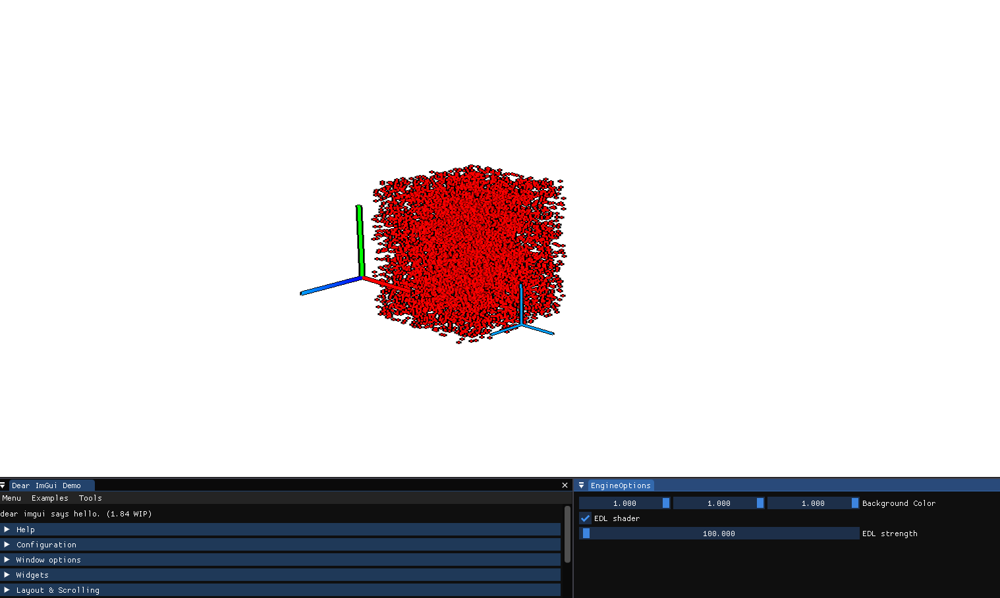
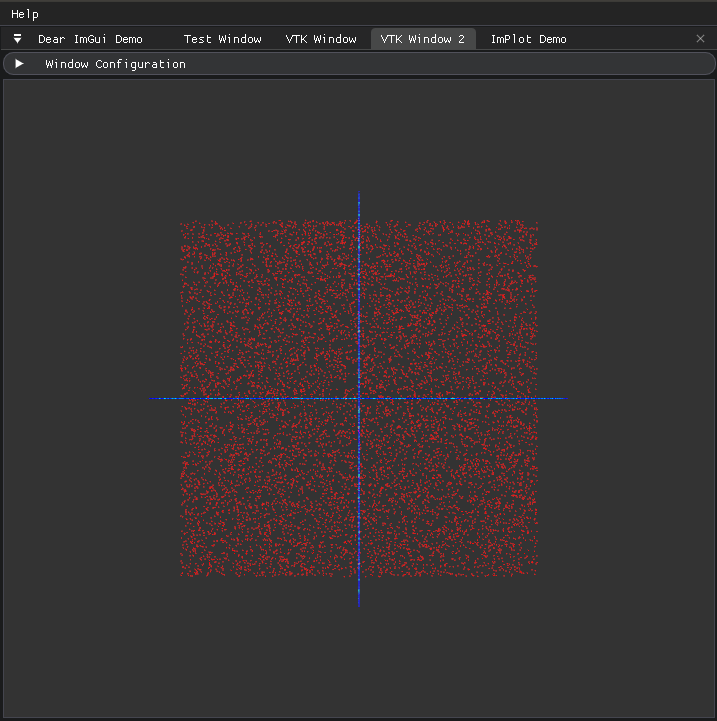

# *viz3d*



> *viz3D* is a lightweight C++ GUI library, integrating [Dear ImGUI](https://github.com/ocornut/imgui) (The amazing graphical interface library for C++), [ImPlot](https://github.com/epezent/implot) (Which provides interactive plotting library)
> and [VTK](https://gitlab.kitware.com/vtk/vtk), the Visualization ToolKit.
>


## Description

> The library is a simple application layer the singleton `GUI`, which opens a `GLFW` window,
> and manages a set of user-defined `ImGUIWindow`s.
>
> We integrate ImGui with the branch `docking`, allowing the creation of multiple viewport and the customization of the layout.
>
> A specialized `VTKWindow` extends an `ImGUIWindow`, and allows the creation and visualization of multiple VTK Pipelines integrated with the ImGui managed layout of windows.
> The pipelines are rendered offscreen in a texture, and then copied in the available space of the window.

## Installation

> `install.sh` and `install.bat` provide complete installation scripts for Linux and Windows.
> They first install the external dependencies (VTK, GLFW, and GLAD), then build the project.
> The install destination is set by default to `./install`.
>

## Usage

> The `viz3d::GUI` singleton manages a set of `viz3d::GUI::ImGuiWindow`. 
> Child classes of `viz3d::GUI::ImGuiWindow` must specify in `DrawImGuiContent` the ImGui components
> to appear on screen.

```c++
// std::thread gui_thread {viz3d::GUI::LaunchMainLoop, "GUI"}; //< Launches the GUI in separate different thread
auto gui = viz3d::GUI::Instance(); //< Initialize the GUI Singleton

gui.AddWindow(std::make_shared<TestWindow>("Test Window")); //< Add a custom ImGui window which specifying the ImGui components to draw 

auto vtk_window = std::make_shared<viz3d::VTKWindow>("VTK Window"); //< Creates a VTKWindow
vtk_window->AddActor(GetConeActor()); //< Add an actor to the window
gui.AddWindow(vtk_window); //< Add the window to the GUI


gui.MainLoop(); //< Launches the MainLoop 
// gui_thread.join();
```

> See `example.cpp` for more details.
> 
> The interactor style used for each VTKWindow is the [vtkInteractorStyleMultiTouchCamera]('https://vtk.org/doc/nightly/html/classvtkInteractorStyleMultiTouchCamera.html). 
> Which works as specified below:
- `Left Mouse Button Pressed`: Rotates the Camera 
- `Shift Key` + `Left Mouse Button Pressed`: Translates the camera
- `Ctrl Key` + `Left Mouse Button Pressed`: Rotates the camera



## TODO(s)
- [ ] Add convenient methods to create richer VTK actors
