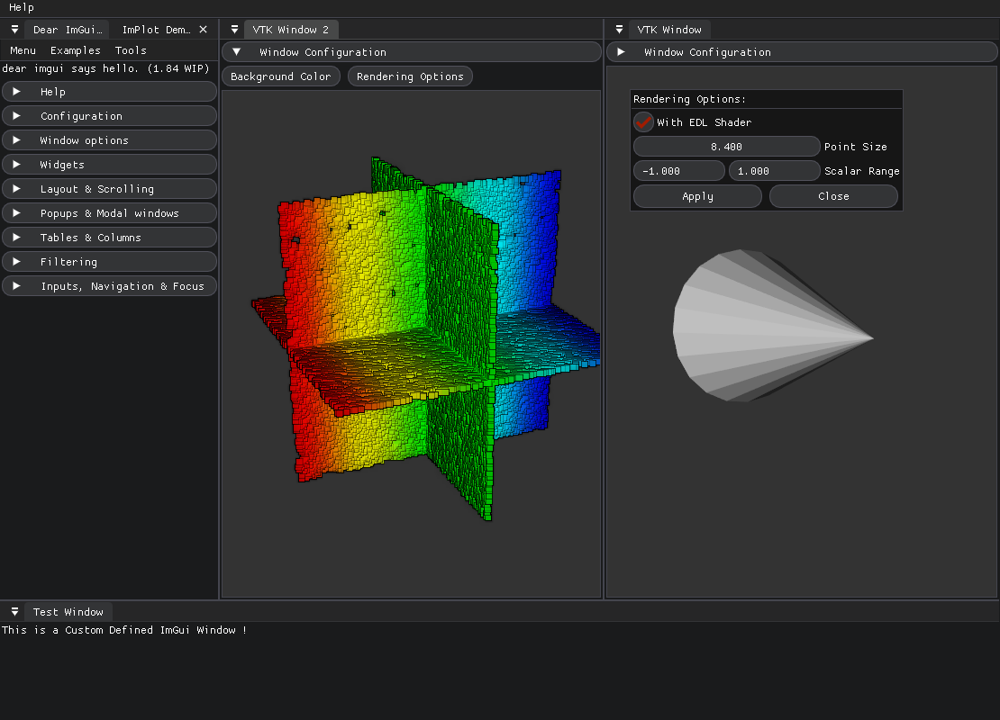

# *viz3d*


> *viz3D* is a lightweight OpenGL-based Point Cloud visualization library, which is primarly designed for research and debug purposes.

# Description

> The main components of the package are:
>  - *The `ExplorationEngine`*
>  - *The `Model`s*
>  - *The `GUIWindow`s*

### `ExplorationEngine`

> The `ExplorationEngine` is a singleton *Rendering Engine*, (shared between threads),
> which manages a **GLFW** window, `Model`s which are rendered in the window, as well as `GUIWindow`s defined by the user.

> The `ExplorationEngine` is created once `Exploration::Instance()` has been called.
> It can be launched in the main thread (*blocking*) with:

```
auto& instance = Exploration::Instance();   # Returns a reference to the Engine
instance.MainLoop();                        # Starts the engine's main loop
```

It can also be launched in a separate thread (*non blocking*) with for instance.

```
std::thread gui_thread{ viz::ExplorationEngine::LaunchMainLoop };

... Do things in the main thread (add models, etc...)

gui_thread.join();
```

> Because it is a singleton, at any place in the code, the engine can be accessed at with:


#### Navigation in the Window

> The user can navigate in the window with a `First Person Camera`, which has the following key binding:

| Key Pressed | Action \*(IF THE CAMERA IS ACTIVATED)|
| --- | --- |
| Z | *move Forward* |
| S | *move Backward* |
| Q | *move Left* |
| D | *move Right* |
| R | *move Up* |
| F | *move Down* |
| A | *rotate clockwise in roll* |
| E | *rotate counter-clockwise in roll* |
| SHIFT  | *Accelerate camera motion x 10, while the key is pressed* |

| Mouse Action | Action |
| --- | --- |
| Right Click | *Activate/Deactivate the Camera* |
| Move the cursor away from the center | *yaw, pitch orientation changes* **IF THE CAMERA IS ACTIVATED** |

#### Options

> The engine's options can be accessed with:

```ExplorationEngine::Instance().Options();```

### `Model`

> The Engine renders in its main loop different `Model`s.
> Each `Model` has the appropriate `ModelData` which contains the data needed by the Engine to render the model.

> The different models availables are:
> - `PointCloudModel`: Renders a colored vector of 3D Points. (if no color is specified, the `default_color` of the corresponding `PointCloudModelData` will be chosen)
> - `PosesModel`: Renders a set of trajectory frames (represented by `x,y,z` axes)

> The engine maintains a map **model id -> Model**.
> The following adds a PointCloud Model to the Engine:

```
#include <viz3d/engine.hpp>

auto& instance = ExplorationEngine::Instance();

auto model_ptr = std::make_shared<PointCloudModel>();
auto& model_data = model_ptr->ModelData();

model_data.xyz.resize(100);
... Fill the Pointcloud

instance.AddModel(1, model_ptr);

instance.SignalClose(); // Closes the engine
```

### `GUIWindow`

> The project integrates [Dear ImGui](https://github.com/ocornut/imgui) as a convenient lightweight GUI system.

> The user can add custom `GUIWindow`s to the engine which will be drawn in the main loop, and allows him to interact graphically the state of the program.

> For more details, look at an [example](src/example/example.cpp) of the usage of *viz3d*, you should see the following:



# TODOS
- [x] Add the option to set the camera programatically
- [x] Close the engine programatically
- [ ] Camera Params (notably speed in guiwindow)
- [ ] Modify the point size of all models from a imgui window
